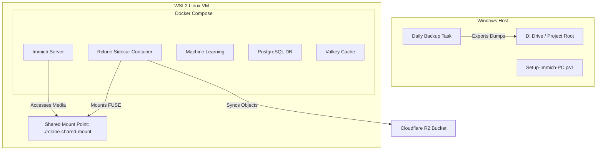

# Immich Photo Gallery - Cloudflare R2 Docker Stack

A professional, self-hosted deployment stack for [Immich](https://immich.app/) running on Windows (via Docker Desktop & WSL2) utilizing Cloudflare R2 object storage. This setup utilizes an **Rclone Sidecar Container** architecture for mounting R2 storage, guaranteeing 100% stability across system reboots.

---

## Architecture Overview



### Why Rclone Sidecar?
Standard setups recommend using the Docker Rclone Volume Plugin. However, on Windows, WSL drive mounts can load slowly after a system reboot, causing the Docker daemon to deadlock and crash during volume restoration. 
This repository solves this natively by running Rclone as a normal **sidecar container** and sharing the mount using WSL's native host mount propagation. **It survives Windows restarts cleanly with zero daemon locks.**

---

## Features

- **Reboot-Resistant:** Native shared mount propagation ensures Docker boots successfully on Windows restarts.
- **100% Portable:** All configurations, scripts, and database backups are self-contained inside the project folder.
- **Automated Backups:** Includes a PowerShell script and registered Windows scheduled task for daily PostgreSQL database dumps.
- **Cloudflare Tunnel Ready:** Configured to bind local-only ports for secure exposure via Cloudflare Zero Trust.

---

## Prerequisites

1. **Operating System:** Windows 11 or Windows Server (with WSL2 enabled).
2. **Docker Desktop:** Configured to use the WSL2 backend.
3. **Cloudflare Account:** An active subscription with a created R2 Bucket.

---

## Installation & Setup

### Step 1: Prepare Environment Files
1. Copy [`.env.example`](.env.example) to `.env` and fill in your database credentials and Cloudflare R2 keys:
   ```powershell
   Copy-Item .env.example .env
   ```
2. Copy [`rclone-config/rclone.conf.example`](rclone-config/rclone.conf.example) to `rclone-config/rclone.conf` and populate it with your R2 access credentials:
   ```powershell
   Copy-Item rclone-config/rclone.conf.example rclone-config/rclone.conf
   ```

> [!IMPORTANT]
> Both `.env` and `rclone-config/rclone.conf` contain sensitive credentials. They are explicitly ignored in `.gitignore` to prevent accidental commits.

### Step 2: Initialize the Host
Run the setup script in an elevated PowerShell terminal to verify Docker, create the host shared mount directory, and register the daily database backup task:
```powershell
powershell -ExecutionPolicy Bypass -File .\Setup-Immich-PC.ps1
```

### Step 3: Start the Stack
Boot the containers in the background:
```powershell
docker compose up -d
```

### Step 4: Verify Health
Run the validation script to ensure all database connections and HTTP endpoints are healthy:
```powershell
powershell -ExecutionPolicy Bypass -File .\scripts\Test-Immich.ps1
```
Once healthy, access your Immich instance locally at:
👉 **[http://localhost:6001](http://localhost:6001)**

---

## Backup & Restore

### Automated Backups
The setup script registers a Windows Scheduled Task named `Immich Daily Backup`. This task runs every day at **2:00 AM** and executes `.\scripts\Backup-Immich.ps1`.
- Backups are stored in `.\backup\<timestamp>\`.
- Each backup folder contains a PostgreSQL binary dump (`immich-postgres.dump`), your `.env`, and your `docker-compose.yml`.

### Restoring the Database
In case of a system migration or data corruption:
1. Ensure the containers are running: `docker compose up -d`
2. Run the following commands to drop, recreate, and restore the dump:
   ```powershell
   # 1. Terminate active DB connections
   docker exec -i my-photo-gallery-immich-postgres psql -U postgres -c "SELECT pg_terminate_backend(pg_stat_activity.pid) FROM pg_stat_activity WHERE pg_stat_activity.datname = 'immich' AND pid <> pg_backend_pid();"

   # 2. Recreate database
   docker exec -i my-photo-gallery-immich-postgres psql -U postgres -c "DROP DATABASE IF EXISTS immich; CREATE DATABASE immich;"

   # 3. Stream restore file
   cmd /c "docker exec -i -e PGPASSWORD=YOUR_DB_PASSWORD my-photo-gallery-immich-postgres pg_restore --username=postgres --dbname=immich < .\backup\<timestamp>\immich-postgres.dump"

   # 4. Restart the server container
   docker compose restart immich-server
   ```

---

## Maintenance & Commands

- **Stop Services:** `docker compose down` *(Do not add `--volumes` or you will lose database state)*
- **Check Status:** `docker compose ps`
- **View Container Logs:** `docker compose logs -f immich-server`
